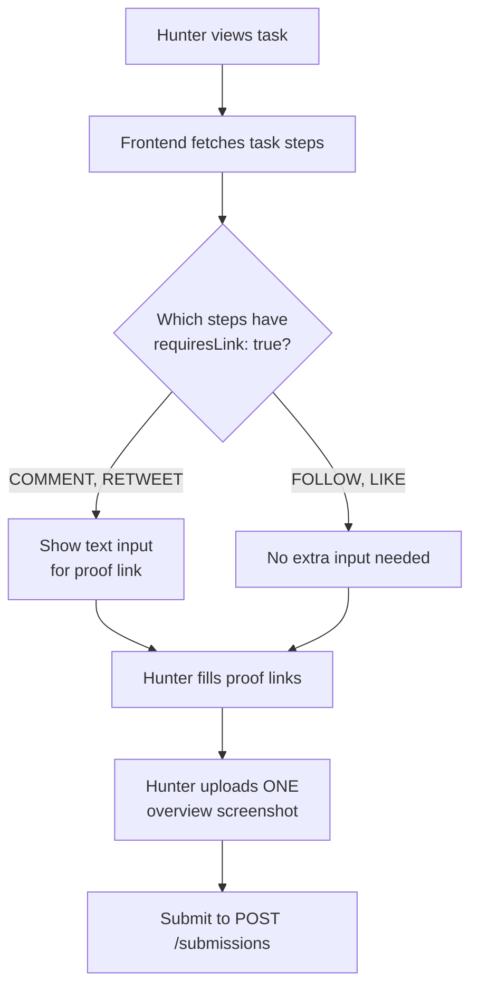

# Proof System Refactor — Walkthrough & Frontend Guide

## Changes Made

### 1. Prisma Schema (`schema.prisma`)
- **`SubmissionProof.url`** → **`proofLink`** — Now a plain URL (tweet permalink, comment URL) instead of an R2 upload key.
- Migration applied: `20260426213839_rename_proof_url_to_proof_link`

```diff:schema.prisma
generator client {
  provider = "prisma-client-js"
}

datasource db {
  provider = "postgresql"
}

// =============================
// ENUMS
// =============================

enum Role {
  USER
  ADMIN
  SUPERADMIN
}

enum TaskLevel {
  EASY
  MEDIUM
  HARD
}

enum TaskStatus {
  ACTIVE
  PAUSED
  COMPLETED
}

enum StepType {
  FOLLOW
  LIKE
  RETWEET
  COMMENT
}

enum SubmissionStatus {
  PENDING
  APPROVED
  REJECTED
}

enum WithdrawalStatus {
  PENDING
  COMPLETED
  REJECTED
}

enum NotificationType {
  SYSTEM
  TASK_STATUS
  SUBMISSION_STATUS
  PAYOUT_STATUS
  ADMIN_BROADCAST
}

enum TransactionType {
  TASK_REWARD
  WITHDRAWAL_REQUEST
  WITHDRAWAL_REVERSAL
}

// =============================
// MODELS
// =============================

model User {
  id              String   @id @default(uuid())
  role            Role     @default(USER)
  isActive        Boolean  @default(true)

  // X (Twitter) identity
  xId             String   @unique
  username        String
  displayName     String?
  profileImage    String?

  walletAddress   String?

  createdAt       DateTime @default(now())
  updatedAt       DateTime @default(now()) @updatedAt

  // relations
  submissions     Submission[]
  withdrawals     Withdrawal[]
  transactions    Transaction[]
  tasksCreated    Task[]        @relation("AdminTasks")
  reviewedSubmissions Submission[] @relation("ReviewedBy")
  notifications       Notification[]

  @@index([xId])
}

model Task {
  id                String     @id @default(uuid())
  title             String
  description       String?
  level             TaskLevel
  rewardMicrounits  BigInt
  maxCompletions    Int
  completedCount    Int        @default(0)
  status            TaskStatus @default(ACTIVE)

  createdById       String
  createdBy         User       @relation("AdminTasks", fields: [createdById], references: [id], onDelete: Cascade)

  createdAt         DateTime   @default(now())
  updatedAt         DateTime   @default(now()) @updatedAt

  // relations
  steps             TaskStep[]
  submissions       Submission[]

  @@index([status])
  @@index([createdById])
}

model TaskStep {
  id            String   @id @default(uuid())
  taskId        String
  title         String
  description   String?
  type          StepType
  targetUrl     String
  requiresLink  Boolean  @default(false)
  order         Int

  task          Task     @relation(fields: [taskId], references: [id], onDelete: Cascade)
  proofs        SubmissionProof[]

  createdAt     DateTime @default(now())
  updatedAt     DateTime @default(now()) @updatedAt

  @@index([taskId])
}

model Submission {
  id            String           @id @default(uuid())
  userId        String
  taskId        String

  status        SubmissionStatus @default(PENDING)

  screenshotUrl String

  reviewedById  String?
  reviewedAt    DateTime?

  createdAt     DateTime         @default(now())
  updatedAt     DateTime         @default(now()) @updatedAt

  user          User             @relation(fields: [userId], references: [id], onDelete: Cascade)
  task          Task             @relation(fields: [taskId], references: [id], onDelete: Cascade)

  reviewedBy    User?            @relation("ReviewedBy", fields: [reviewedById], references: [id], onDelete: SetNull)

  proofs        SubmissionProof[]

  @@unique([userId, taskId])
  @@index([status])
  @@index([userId])
  @@index([taskId])
}

model SubmissionProof {
  id             String   @id @default(uuid())
  submissionId   String
  taskStepId     String

  url            String

  submission     Submission @relation(fields: [submissionId], references: [id], onDelete: Cascade)
  taskStep       TaskStep   @relation(fields: [taskStepId], references: [id], onDelete: Cascade)

  createdAt      DateTime @default(now())

  @@index([submissionId])
  @@index([taskStepId])
}

model Withdrawal {
  id              String            @id @default(uuid())
  userId          String

  amount          BigInt
  walletAddress   String
  transactionHash String?

  status          WithdrawalStatus  @default(PENDING)

  createdAt       DateTime          @default(now())
  updatedAt       DateTime          @default(now()) @updatedAt
  processedAt     DateTime?

  user            User              @relation(fields: [userId], references: [id], onDelete: Cascade)

  @@index([status])
  @@index([userId])
  @@unique([transactionHash])
}

model Transaction {
  id            String           @id @default(uuid())
  userId        String

  type          TransactionType
  amount        BigInt

  referenceId   String?

  createdAt     DateTime         @default(now())
  updatedAt     DateTime         @default(now()) @updatedAt

  user          User             @relation(fields: [userId], references: [id], onDelete: Cascade)

  @@index([userId])
  @@unique([type, referenceId])
}

model Notification {
  id          String           @id @default(uuid())
  userId      String?          // Nullable for global/broadcast notifications if we want
  
  type        NotificationType
  title       String
  message     String
  referenceId String?          // ID of task, submission, or withdrawal

  isRead      Boolean          @default(false)
  
  createdAt   DateTime         @default(now())

  user        User?            @relation(fields: [userId], references: [id], onDelete: Cascade)

  @@index([userId])
  @@index([isRead])
  @@index([createdAt])
}
===
generator client {
  provider = "prisma-client-js"
}

datasource db {
  provider = "postgresql"
}

// =============================
// ENUMS
// =============================

enum Role {
  USER
  ADMIN
  SUPERADMIN
}

enum TaskLevel {
  EASY
  MEDIUM
  HARD
}

enum TaskStatus {
  ACTIVE
  PAUSED
  COMPLETED
}

enum StepType {
  FOLLOW
  LIKE
  RETWEET
  COMMENT
}

enum SubmissionStatus {
  PENDING
  APPROVED
  REJECTED
}

enum WithdrawalStatus {
  PENDING
  COMPLETED
  REJECTED
}

enum NotificationType {
  SYSTEM
  TASK_STATUS
  SUBMISSION_STATUS
  PAYOUT_STATUS
  ADMIN_BROADCAST
}

enum TransactionType {
  TASK_REWARD
  WITHDRAWAL_REQUEST
  WITHDRAWAL_REVERSAL
}

// =============================
// MODELS
// =============================

model User {
  id              String   @id @default(uuid())
  role            Role     @default(USER)
  isActive        Boolean  @default(true)

  // X (Twitter) identity
  xId             String   @unique
  username        String
  displayName     String?
  profileImage    String?

  walletAddress   String?

  createdAt       DateTime @default(now())
  updatedAt       DateTime @default(now()) @updatedAt

  // relations
  submissions     Submission[]
  withdrawals     Withdrawal[]
  transactions    Transaction[]
  tasksCreated    Task[]        @relation("AdminTasks")
  reviewedSubmissions Submission[] @relation("ReviewedBy")
  notifications       Notification[]

  @@index([xId])
}

model Task {
  id                String     @id @default(uuid())
  title             String
  description       String?
  level             TaskLevel
  rewardMicrounits  BigInt
  maxCompletions    Int
  completedCount    Int        @default(0)
  status            TaskStatus @default(ACTIVE)

  createdById       String
  createdBy         User       @relation("AdminTasks", fields: [createdById], references: [id], onDelete: Cascade)

  createdAt         DateTime   @default(now())
  updatedAt         DateTime   @default(now()) @updatedAt

  // relations
  steps             TaskStep[]
  submissions       Submission[]

  @@index([status])
  @@index([createdById])
}

model TaskStep {
  id            String   @id @default(uuid())
  taskId        String
  title         String
  description   String?
  type          StepType
  targetUrl     String
  requiresLink  Boolean  @default(false)
  order         Int

  task          Task     @relation(fields: [taskId], references: [id], onDelete: Cascade)
  proofs        SubmissionProof[]

  createdAt     DateTime @default(now())
  updatedAt     DateTime @default(now()) @updatedAt

  @@index([taskId])
}

model Submission {
  id            String           @id @default(uuid())
  userId        String
  taskId        String

  status        SubmissionStatus @default(PENDING)

  screenshotUrl String

  reviewedById  String?
  reviewedAt    DateTime?

  createdAt     DateTime         @default(now())
  updatedAt     DateTime         @default(now()) @updatedAt

  user          User             @relation(fields: [userId], references: [id], onDelete: Cascade)
  task          Task             @relation(fields: [taskId], references: [id], onDelete: Cascade)

  reviewedBy    User?            @relation("ReviewedBy", fields: [reviewedById], references: [id], onDelete: SetNull)

  proofs        SubmissionProof[]

  @@unique([userId, taskId])
  @@index([status])
  @@index([userId])
  @@index([taskId])
}

model SubmissionProof {
  id             String   @id @default(uuid())
  submissionId   String
  taskStepId     String

  proofLink      String   // Plain URL: tweet link, comment permalink, etc.

  submission     Submission @relation(fields: [submissionId], references: [id], onDelete: Cascade)
  taskStep       TaskStep   @relation(fields: [taskStepId], references: [id], onDelete: Cascade)

  createdAt      DateTime @default(now())

  @@index([submissionId])
  @@index([taskStepId])
}

model Withdrawal {
  id              String            @id @default(uuid())
  userId          String

  amount          BigInt
  walletAddress   String
  transactionHash String?

  status          WithdrawalStatus  @default(PENDING)

  createdAt       DateTime          @default(now())
  updatedAt       DateTime          @default(now()) @updatedAt
  processedAt     DateTime?

  user            User              @relation(fields: [userId], references: [id], onDelete: Cascade)

  @@index([status])
  @@index([userId])
  @@unique([transactionHash])
}

model Transaction {
  id            String           @id @default(uuid())
  userId        String

  type          TransactionType
  amount        BigInt

  referenceId   String?

  createdAt     DateTime         @default(now())
  updatedAt     DateTime         @default(now()) @updatedAt

  user          User             @relation(fields: [userId], references: [id], onDelete: Cascade)

  @@index([userId])
  @@unique([type, referenceId])
}

model Notification {
  id          String           @id @default(uuid())
  userId      String?          // Nullable for global/broadcast notifications if we want
  
  type        NotificationType
  title       String
  message     String
  referenceId String?          // ID of task, submission, or withdrawal

  isRead      Boolean          @default(false)
  
  createdAt   DateTime         @default(now())

  user        User?            @relation(fields: [userId], references: [id], onDelete: Cascade)

  @@index([userId])
  @@index([isRead])
  @@index([createdAt])
}
```

---

### 2. Task Validation (`task.validation.ts`)
- `requiresLink` is now **auto-defaulted** based on step type when the admin doesn't explicitly set it:

| Step Type | Default `requiresLink` | Rationale |
|-----------|----------------------|-----------|
| `COMMENT` | `true` | Comment has a permalink the hunter can share |
| `RETWEET` | `true` | Retweet has a permalink the hunter can share |
| `FOLLOW` | `false` | Hunter's profile is already known via X auth |
| `LIKE` | `false` | Likes have no permalink |

- Admin can still override by explicitly passing `requiresLink: true/false`

```diff:task.validation.ts
import { z } from 'zod';
import { paginationSchema } from '../../utils/pagination.js';

const usdcAmountSchema = z
  .number()
  .positive('Amount must be positive.')
  .refine((value) => Number(value.toFixed(6)) === value, {
    message: 'Amount can have at most 6 decimal places.',
  });

/**
 * Validates a single task step during creation.
 */
const taskStepSchema = z.object({
  title: z.string().min(5, 'Step title must be at least 5 characters long.').max(100),
  description: z.string().max(1000).optional(),
  type: z.enum(['FOLLOW', 'LIKE', 'RETWEET', 'COMMENT']),
  targetUrl: z.string().url('Target URL must be a valid URL.'),
  requiresLink: z.boolean().default(false),
  order: z.number().int().min(0, 'Order must be a non-negative integer.'),
});

function hasContiguousZeroBasedOrder(steps: Array<{ order: number }>) {
  const sortedOrders = steps.map((step) => step.order).sort((a, b) => a - b);
  return sortedOrders.every((order, index) => order === index);
}

/**
 * Schema for creating a new task (Admin only).
 */
export const createTaskSchema = z.object({
  title: z.string().min(5, 'Title must be at least 5 characters long.').max(100),
  description: z.string().max(1000).optional(),
  level: z.enum(['EASY', 'MEDIUM', 'HARD']),
  rewardUsdc: usdcAmountSchema,
  maxCompletions: z.number().int().positive('Max completions must be at least 1.'),
  steps: z.array(taskStepSchema).min(1, 'Task must have at least one step.'),
}).superRefine((data, ctx) => {
  const seenOrders = new Set<number>();

  data.steps.forEach((step, index) => {
    if (seenOrders.has(step.order)) {
      ctx.addIssue({
        code: z.ZodIssueCode.custom,
        path: ['steps', index, 'order'],
        message: 'Step order values must be unique.',
      });
      return;
    }

    seenOrders.add(step.order);
  });

  if (!hasContiguousZeroBasedOrder(data.steps)) {
    ctx.addIssue({
      code: z.ZodIssueCode.custom,
      path: ['steps'],
      message: 'Step order values must form a contiguous zero-based sequence (0, 1, 2, ...).',
    });
  }
});

export const userTaskListQuerySchema = paginationSchema.extend({
  level: z.enum(['EASY', 'MEDIUM', 'HARD']).optional(),
});

export const adminTaskListQuerySchema = paginationSchema.extend({
  status: z.enum(['ACTIVE', 'PAUSED', 'COMPLETED']).optional(),
  level: z.enum(['EASY', 'MEDIUM', 'HARD']).optional(),
});

/**
 * Schema for updating task metadata (Admin only).
 * Steps are immutable and cannot be updated via this schema.
 */
export const updateTaskSchema = z.object({
  title: z.string().min(5).max(100).optional(),
  description: z.string().max(1000).optional(),
  level: z.enum(['EASY', 'MEDIUM', 'HARD']).optional(),
  rewardUsdc: usdcAmountSchema.optional(),
  maxCompletions: z.number().int().positive().optional(),
  status: z.enum(['ACTIVE', 'PAUSED', 'COMPLETED']).optional(),
});

export type CreateTaskInput = z.infer<typeof createTaskSchema>;
export type UpdateTaskInput = z.infer<typeof updateTaskSchema>;
===
import { z } from 'zod';
import { paginationSchema } from '../../utils/pagination.js';

const usdcAmountSchema = z
  .number()
  .positive('Amount must be positive.')
  .refine((value) => Number(value.toFixed(6)) === value, {
    message: 'Amount can have at most 6 decimal places.',
  });

/**
 * Default proof-link requirement by step type.
 * COMMENT & RETWEET produce linkable artifacts the hunter can share.
 * FOLLOW & LIKE do not (profile is already known via X auth, likes have no permalink).
 */
const REQUIRES_LINK_DEFAULTS: Record<string, boolean> = {
  FOLLOW: false,
  LIKE: false,
  RETWEET: true,
  COMMENT: true,
};

/**
 * Validates a single task step during creation.
 * If the admin doesn't explicitly set requiresLink, it auto-defaults based on the step type.
 */
const taskStepSchema = z.object({
  title: z.string().min(5, 'Step title must be at least 5 characters long.').max(100),
  description: z.string().max(1000).optional(),
  type: z.enum(['FOLLOW', 'LIKE', 'RETWEET', 'COMMENT']),
  targetUrl: z.string().url('Target URL must be a valid URL.'),
  requiresLink: z.boolean().optional(),
  order: z.number().int().min(0, 'Order must be a non-negative integer.'),
}).transform((step) => ({
  ...step,
  requiresLink: step.requiresLink ?? REQUIRES_LINK_DEFAULTS[step.type] ?? false,
}));

function hasContiguousZeroBasedOrder(steps: Array<{ order: number }>) {
  const sortedOrders = steps.map((step) => step.order).sort((a, b) => a - b);
  return sortedOrders.every((order, index) => order === index);
}

/**
 * Schema for creating a new task (Admin only).
 */
export const createTaskSchema = z.object({
  title: z.string().min(5, 'Title must be at least 5 characters long.').max(100),
  description: z.string().max(1000).optional(),
  level: z.enum(['EASY', 'MEDIUM', 'HARD']),
  rewardUsdc: usdcAmountSchema,
  maxCompletions: z.number().int().positive('Max completions must be at least 1.'),
  steps: z.array(taskStepSchema).min(1, 'Task must have at least one step.'),
}).superRefine((data, ctx) => {
  const seenOrders = new Set<number>();

  data.steps.forEach((step, index) => {
    if (seenOrders.has(step.order)) {
      ctx.addIssue({
        code: z.ZodIssueCode.custom,
        path: ['steps', index, 'order'],
        message: 'Step order values must be unique.',
      });
      return;
    }

    seenOrders.add(step.order);
  });

  if (!hasContiguousZeroBasedOrder(data.steps)) {
    ctx.addIssue({
      code: z.ZodIssueCode.custom,
      path: ['steps'],
      message: 'Step order values must form a contiguous zero-based sequence (0, 1, 2, ...).',
    });
  }
});

export const userTaskListQuerySchema = paginationSchema.extend({
  level: z.enum(['EASY', 'MEDIUM', 'HARD']).optional(),
});

export const adminTaskListQuerySchema = paginationSchema.extend({
  status: z.enum(['ACTIVE', 'PAUSED', 'COMPLETED']).optional(),
  level: z.enum(['EASY', 'MEDIUM', 'HARD']).optional(),
});

/**
 * Schema for updating task metadata (Admin only).
 * Steps are immutable and cannot be updated via this schema.
 */
export const updateTaskSchema = z.object({
  title: z.string().min(5).max(100).optional(),
  description: z.string().max(1000).optional(),
  level: z.enum(['EASY', 'MEDIUM', 'HARD']).optional(),
  rewardUsdc: usdcAmountSchema.optional(),
  maxCompletions: z.number().int().positive().optional(),
  status: z.enum(['ACTIVE', 'PAUSED', 'COMPLETED']).optional(),
});

export type CreateTaskInput = z.infer<typeof createTaskSchema>;
export type UpdateTaskInput = z.infer<typeof updateTaskSchema>;
```

---

### 3. Submission Validation (`submission.validation.ts`)
- `submissionProofSchema.url` → `submissionProofSchema.proofLink`
- `proofs` array now defaults to `[]` (empty) — no longer requires `.min(1)`
- Service layer validates that proofs are provided for exactly the steps that need them

```diff:submission.validation.ts
import { z } from 'zod';
import { paginationSchema } from '../../utils/pagination.js';

/**
 * Validates a request for a presigned upload URL.
 */
export const uploadUrlSchema = z.object({
  contentType: z.enum(['image/png', 'image/jpeg', 'image/jpg', 'image/webp'], {
    message: 'Invalid file type. Only PNG, JPEG, and WebP are allowed.',
  }),
  fileName: z.string().min(1).max(255),
});

/**
 * Validates a specific step proof during submission.
 */
const submissionProofSchema = z.object({
  taskStepId: z.string().uuid(),
  url: z.string().url('Proof URL must be a valid link.'),
});

/**
 * Validates a task submission.
 */
export const createSubmissionSchema = z.object({
  taskId: z.string().uuid(),
  screenshotUrl: z.string().url('Main screenshot URL is required.'),
  proofs: z.array(submissionProofSchema).min(1, 'At least one step proof is required.'),
});

/**
 * Validates an admin's submission review.
 */
export const reviewSubmissionSchema = z.object({
  status: z.enum(['APPROVED', 'REJECTED']),
  feedback: z.string().max(500).optional(),
});

export const userSubmissionListQuerySchema = paginationSchema.extend({
  status: z.enum(['PENDING', 'APPROVED', 'REJECTED']).optional(),
});

export const adminSubmissionListQuerySchema = paginationSchema.extend({
  status: z.enum(['PENDING', 'APPROVED', 'REJECTED']).optional(),
});

export type UploadUrlInput = z.infer<typeof uploadUrlSchema>;
export type CreateSubmissionInput = z.infer<typeof createSubmissionSchema>;
export type ReviewSubmissionInput = z.infer<typeof reviewSubmissionSchema>;
===
import { z } from 'zod';
import { paginationSchema } from '../../utils/pagination.js';

/**
 * Validates a request for a presigned upload URL.
 */
export const uploadUrlSchema = z.object({
  contentType: z.enum(['image/png', 'image/jpeg', 'image/jpg', 'image/webp'], {
    message: 'Invalid file type. Only PNG, JPEG, and WebP are allowed.',
  }),
  fileName: z.string().min(1).max(255),
});

/**
 * Validates a specific step proof during submission.
 * proofLink is a plain URL (e.g. tweet permalink, comment URL) — NOT an R2 upload key.
 */
const submissionProofSchema = z.object({
  taskStepId: z.string().uuid(),
  proofLink: z.string().url('Proof link must be a valid URL.'),
});

/**
 * Validates a task submission.
 * proofs is optional — only steps with requiresLink: true need a proof entry.
 */
export const createSubmissionSchema = z.object({
  taskId: z.string().uuid(),
  screenshotUrl: z.string().url('Main screenshot URL is required.'),
  proofs: z.array(submissionProofSchema).default([]),
});

/**
 * Validates an admin's submission review.
 */
export const reviewSubmissionSchema = z.object({
  status: z.enum(['APPROVED', 'REJECTED']),
  feedback: z.string().max(500).optional(),
});

export const userSubmissionListQuerySchema = paginationSchema.extend({
  status: z.enum(['PENDING', 'APPROVED', 'REJECTED']).optional(),
});

export const adminSubmissionListQuerySchema = paginationSchema.extend({
  status: z.enum(['PENDING', 'APPROVED', 'REJECTED']).optional(),
});

export type UploadUrlInput = z.infer<typeof uploadUrlSchema>;
export type CreateSubmissionInput = z.infer<typeof createSubmissionSchema>;
export type ReviewSubmissionInput = z.infer<typeof reviewSubmissionSchema>;
```

---

### 4. Submission Service (`submission.service.ts`)
- **`validateProofsAgainstTask`**: Now only requires proofs for steps where `requiresLink === true`
- **Proof URL validation**: Removed `assertValidAssetKey` for proofs — they're plain URLs, not R2 keys
- **`formatSubmission`**: Removed R2 signing for proof URLs (they're plain links now)

```diff:submission.service.ts
import { Prisma } from '@prisma/client';
import { prisma } from "../../config/db.js";
import type {
  CreateSubmissionInput,
  ReviewSubmissionInput,
} from "./submission.validation.js";
import { StorageService } from "../../services/storage.service.js";
import { formatMicrounitsToUsdc } from '../../utils/money.js';
import { NotificationService } from '../notification/notification.service.js';
import { logger } from '../../utils/logger.js';

export class SubmissionService {
  private static assertValidAssetKey(input: string, userId: string, fieldName: string) {
    const key = StorageService.extractKeyFromUrl(input);
    const expectedPrefix = `proofs/${userId}/`;

    if (!key.startsWith(expectedPrefix)) {
      throw new Error(`${fieldName} must be a BlockForge upload belonging to the current user.`);
    }
  }

  private static validateProofsAgainstTask(
    userId: string,
    screenshotUrl: string,
    proofs: CreateSubmissionInput["proofs"],
    task: {
      id: string;
      status: string;
      steps: Array<{
        id: string;
        requiresLink: boolean;
      }>;
    },
  ) {
    this.assertValidAssetKey(screenshotUrl, userId, "Screenshot URL");

    const taskStepIds = new Set(task.steps.map((step) => step.id));
    const requiredStepIds = new Set(task.steps.map((step) => step.id));
    const seenStepIds = new Set<string>();

    for (const proof of proofs) {
      if (!taskStepIds.has(proof.taskStepId)) {
        throw new Error("Proof contains a step that does not belong to this task.");
      }

      if (seenStepIds.has(proof.taskStepId)) {
        throw new Error("Duplicate proof submitted for the same task step.");
      }
      seenStepIds.add(proof.taskStepId);

      this.assertValidAssetKey(proof.url, userId, "Proof URL");
    }

    if (seenStepIds.size !== requiredStepIds.size) {
      throw new Error("Proofs must be provided for every task step exactly once.");
    }
  }

  /**
   * Creates a new submission for a task.
   * Ensures the task is active and the user hasn't already submitted.
   */
  static async createSubmission(userId: string, input: CreateSubmissionInput) {
    const { taskId, screenshotUrl, proofs } = input;

    // 1. Check if task exists and is active
    const task = await prisma.task.findUnique({
      where: { id: taskId },
      include: {
        steps: {
          select: {
            id: true,
            requiresLink: true,
          },
          orderBy: { order: "asc" },
        },
      },
    });

    if (!task) throw new Error("Task not found.");
    if (task.status !== "ACTIVE")
      throw new Error("This task is no longer accepting submissions.");
    if (task.steps.length === 0) {
      throw new Error("Task is misconfigured and cannot accept submissions.");
    }

    this.validateProofsAgainstTask(userId, screenshotUrl, proofs, task);

    // 2. Perform atomic creation
    return prisma.$transaction(async (tx: Prisma.TransactionClient) => {
      // Create the main submission
      // Unique constraint on (userId, taskId) will catch dual submissions
      const submission = await tx.submission.create({
        data: {
          userId,
          taskId,
          screenshotUrl,
          status: "PENDING",
        },
      });

      // Create step-specific proofs
      if (proofs && proofs.length > 0) {
        await tx.submissionProof.createMany({
          data: proofs.map((p) => ({
            submissionId: submission.id,
            taskStepId: p.taskStepId,
            url: p.url,
          })),
        });
      }

      return submission;
    });
  }

  /**
   * Reviews a submission (Admin only).
   * If approved, triggers a transaction to the user's ledger and updates task count.
   */
  static async reviewSubmission(
    adminId: string,
    submissionId: string,
    input: ReviewSubmissionInput,
  ) {
    const { status } = input;

    return prisma.$transaction(async (tx: Prisma.TransactionClient) => {
      const submission = await tx.submission.findUnique({
        where: { id: submissionId },
        include: { task: true },
      });

      if (!submission) throw new Error("Submission not found.");
      if (submission.status !== "PENDING") {
        throw new Error("Submission has already been reviewed.");
      }

      // 1. Atomically claim the submission while it is still pending
      const claimedSubmission = await tx.submission.updateMany({
        where: { id: submissionId, status: "PENDING" },
        data: {
          status,
          reviewedById: adminId,
          reviewedAt: new Date(),
        },
      });

      if (claimedSubmission.count !== 1) {
        throw new Error("Submission has already been reviewed.");
      }

      // 2. If approved, handle rewards and counters
      if (status === "APPROVED") {
        const currentTask = await tx.task.findUnique({
          where: { id: submission.taskId },
        });

        if (!currentTask) {
          throw new Error("Task not found.");
        }

        const incrementedTask = await tx.task.updateMany({
          where: {
            id: submission.taskId,
            completedCount: { lt: currentTask.maxCompletions },
          },
          data: {
            completedCount: { increment: 1 },
          },
        });

        if (incrementedTask.count !== 1) {
          throw new Error("Task has already reached its max completions.");
        }

        // Create the transaction record (User's balance is computed from these)
        // Ensure the reward is always credited as a positive value
        const rewardAmount = submission.task.rewardMicrounits > 0n 
          ? submission.task.rewardMicrounits 
          : -submission.task.rewardMicrounits;

        await tx.transaction.create({
          data: {
            userId: submission.userId,
            type: "TASK_REWARD",
            amount: rewardAmount,
            referenceId: submission.id,
          },
        });

        // Optionally check if task is now fully completed
        const task = await tx.task.findUnique({
          where: { id: submission.taskId },
        });
        if (task && task.completedCount >= task.maxCompletions) {
          await tx.task.update({
            where: { id: task.id },
            data: { status: "COMPLETED" },
          });
        }
      }

      const result = await tx.submission.findUnique({
        where: { id: submissionId },
        include: { task: true },
      });

      if (result) {
        NotificationService.createNotification({
          userId: result.userId,
          type: 'SUBMISSION_STATUS',
          title: status === 'APPROVED' ? 'Submission Approved!' : 'Submission Rejected',
          message: status === 'APPROVED' 
            ? `Good job! Your submission for "${result.task.title}" was approved and you earned ${formatMicrounitsToUsdc(result.task.rewardMicrounits)} USDC.`
            : `Your submission for "${result.task.title}" was rejected. Please review the requirements and try a different task.`,
          referenceId: result.id,
        }).catch((err) => logger.error(`Submission notification failed: ${err}`));
      }

      return this.formatSubmission(result);
    });
  }

  /**
   * Helper to format Decimal fields and generate secure signed URLs for private assets.
   */
  private static async formatSubmission(s: any) {
    if (!s) return null;

    // 1. Sign the main screenshot URL
    let screenshotUrl = s.screenshotUrl;
    if (screenshotUrl) {
      const key = StorageService.extractKeyFromUrl(screenshotUrl);
      screenshotUrl = await StorageService.getSignedViewUrl(key).catch(() => screenshotUrl);
    }

    // 2. Sign all proof URLs in parallel
    let proofs = s.proofs;
    if (proofs && proofs.length > 0) {
      proofs = await Promise.all(
        proofs.map(async (p: any) => {
          if (!p.url) return p;
          const key = StorageService.extractKeyFromUrl(p.url);
          const signedUrl = await StorageService.getSignedViewUrl(key).catch(() => p.url);
          return { ...p, url: signedUrl };
        })
      );
    }

    return {
      ...s,
      screenshotUrl,
      proofs,
      task: s.task
        ? (() => {
            const { rewardMicrounits, ...rest } = s.task;
            return {
              ...rest,
              rewardUsdc: formatMicrounitsToUsdc(rewardMicrounits),
            };
          })()
        : undefined,
    };
  }

  /**
   * Lists submissions for a specific user.
   */
  static async getUserSubmissions(userId: string, filters: any = {}) {
    const { status, page = 1, limit = 20 } = filters;
    const skip = (page - 1) * limit;

    const where = {
      userId,
      ...(status ? { status } : {}),
    };

    const [submissions, total] = await Promise.all([
      prisma.submission.findMany({
        where,
        include: {
          task: { select: { title: true, rewardMicrounits: true } },
        },
        orderBy: { createdAt: "desc" },
        skip,
        take: limit,
      }),
      prisma.submission.count({ where }),
    ]);

    return {
      data: await Promise.all(submissions.map((s: any) => this.formatSubmission(s))),
      metadata: {
        total,
        page,
        limit,
        totalPages: Math.ceil(total / limit),
      },
    };
  }

  /**
   * Lists pending submissions for admin review.
   */
  static async getPendingSubmissions(filters: any = {}) {
    const { status = "PENDING", page = 1, limit = 20 } = filters;
    const skip = (page - 1) * limit;

    const where = { status };

    const [submissions, total] = await Promise.all([
      prisma.submission.findMany({
        where,
        include: {
          user: { select: { username: true, displayName: true } },
          task: { select: { title: true, rewardMicrounits: true } },
          proofs: { include: { taskStep: true } },
        },
        orderBy: { createdAt: "asc" },
        skip,
        take: limit,
      }),
      prisma.submission.count({ where }),
    ]);

    return {
      data: await Promise.all(submissions.map((s: any) => this.formatSubmission(s))),
      metadata: {
        total,
        page,
        limit,
        totalPages: Math.ceil(total / limit),
      },
    };
  }

  /**
   * Gets specific submission details.
   */
  static async getSubmissionById(id: string) {
    const submission = await prisma.submission.findUnique({
      where: { id },
      include: {
        user: true,
        task: { include: { steps: true } },
        proofs: { include: { taskStep: true } },
      },
    });
    return await this.formatSubmission(submission);
  }

  /**
   * Lists all submissions for a specific task.
   * Useful for admins to review all proofs for a single task at once.
   */
  static async getSubmissionsByTask(taskId: string, filters: any = {}) {
    const { page = 1, limit = 20 } = filters;
    const skip = (page - 1) * limit;

    const where = { taskId };

    const [submissions, total] = await Promise.all([
      prisma.submission.findMany({
        where,
        include: {
          user: { select: { username: true, displayName: true } },
          proofs: { include: { taskStep: true } },
        },
        orderBy: [
          { status: "asc" }, // Pending first
          { createdAt: "desc" },
        ],
        skip,
        take: limit,
      }),
      prisma.submission.count({ where }),
    ]);

    return {
      data: await Promise.all(submissions.map((s: any) => this.formatSubmission(s))),
      metadata: {
        total,
        page,
        limit,
        totalPages: Math.ceil(total / limit),
      },
    };
  }
}
===
import { Prisma } from '@prisma/client';
import { prisma } from "../../config/db.js";
import type {
  CreateSubmissionInput,
  ReviewSubmissionInput,
} from "./submission.validation.js";
import { StorageService } from "../../services/storage.service.js";
import { formatMicrounitsToUsdc } from '../../utils/money.js';
import { NotificationService } from '../notification/notification.service.js';
import { logger } from '../../utils/logger.js';

export class SubmissionService {
  private static assertValidAssetKey(input: string, userId: string, fieldName: string) {
    const key = StorageService.extractKeyFromUrl(input);
    const expectedPrefix = `proofs/${userId}/`;

    if (!key.startsWith(expectedPrefix)) {
      throw new Error(`${fieldName} must be a BlockForge upload belonging to the current user.`);
    }
  }

  /**
   * Validates submission proofs against the task's step requirements.
   * Only steps with requiresLink=true need a proof link from the hunter.
   * Steps with requiresLink=false (LIKE, FOLLOW) don't need individual proof.
   */
  private static validateProofsAgainstTask(
    userId: string,
    screenshotUrl: string,
    proofs: CreateSubmissionInput["proofs"],
    task: {
      id: string;
      status: string;
      steps: Array<{
        id: string;
        requiresLink: boolean;
      }>;
    },
  ) {
    // Validate the main screenshot is an R2 upload belonging to this user
    this.assertValidAssetKey(screenshotUrl, userId, "Screenshot URL");

    // Build a set of step IDs that require a proof link
    const stepsRequiringLink = task.steps.filter((s) => s.requiresLink);
    const requiredStepIds = new Set(stepsRequiringLink.map((s) => s.id));
    const allStepIds = new Set(task.steps.map((s) => s.id));
    const seenStepIds = new Set<string>();

    for (const proof of proofs) {
      // Proof must reference a valid step in this task
      if (!allStepIds.has(proof.taskStepId)) {
        throw new Error("Proof references a step that does not belong to this task.");
      }

      // Only accept proofs for steps that actually require a link
      if (!requiredStepIds.has(proof.taskStepId)) {
        throw new Error("Proof submitted for a step that does not require a link.");
      }

      if (seenStepIds.has(proof.taskStepId)) {
        throw new Error("Duplicate proof submitted for the same task step.");
      }
      seenStepIds.add(proof.taskStepId);

      // proofLink is a plain URL (tweet/comment permalink) — no R2 key validation needed
    }

    // Ensure every required step has exactly one proof
    for (const requiredId of requiredStepIds) {
      if (!seenStepIds.has(requiredId)) {
        throw new Error("Missing proof link for a required task step.");
      }
    }
  }

  /**
   * Creates a new submission for a task.
   * Ensures the task is active and the user hasn't already submitted.
   */
  static async createSubmission(userId: string, input: CreateSubmissionInput) {
    const { taskId, screenshotUrl, proofs } = input;

    // 1. Check if task exists and is active
    const task = await prisma.task.findUnique({
      where: { id: taskId },
      include: {
        steps: {
          select: {
            id: true,
            requiresLink: true,
          },
          orderBy: { order: "asc" },
        },
      },
    });

    if (!task) throw new Error("Task not found.");
    if (task.status !== "ACTIVE")
      throw new Error("This task is no longer accepting submissions.");
    if (task.steps.length === 0) {
      throw new Error("Task is misconfigured and cannot accept submissions.");
    }

    this.validateProofsAgainstTask(userId, screenshotUrl, proofs, task);

    // 2. Perform atomic creation
    return prisma.$transaction(async (tx: Prisma.TransactionClient) => {
      // Create the main submission
      // Unique constraint on (userId, taskId) will catch dual submissions
      const submission = await tx.submission.create({
        data: {
          userId,
          taskId,
          screenshotUrl,
          status: "PENDING",
        },
      });

      // Create step-specific proof links (only for steps with requiresLink=true)
      if (proofs && proofs.length > 0) {
        await tx.submissionProof.createMany({
          data: proofs.map((p) => ({
            submissionId: submission.id,
            taskStepId: p.taskStepId,
            proofLink: p.proofLink,
          })),
        });
      }

      return submission;
    });
  }

  /**
   * Reviews a submission (Admin only).
   * If approved, triggers a transaction to the user's ledger and updates task count.
   */
  static async reviewSubmission(
    adminId: string,
    submissionId: string,
    input: ReviewSubmissionInput,
  ) {
    const { status } = input;

    return prisma.$transaction(async (tx: Prisma.TransactionClient) => {
      const submission = await tx.submission.findUnique({
        where: { id: submissionId },
        include: { task: true },
      });

      if (!submission) throw new Error("Submission not found.");
      if (submission.status !== "PENDING") {
        throw new Error("Submission has already been reviewed.");
      }

      // 1. Atomically claim the submission while it is still pending
      const claimedSubmission = await tx.submission.updateMany({
        where: { id: submissionId, status: "PENDING" },
        data: {
          status,
          reviewedById: adminId,
          reviewedAt: new Date(),
        },
      });

      if (claimedSubmission.count !== 1) {
        throw new Error("Submission has already been reviewed.");
      }

      // 2. If approved, handle rewards and counters
      if (status === "APPROVED") {
        const currentTask = await tx.task.findUnique({
          where: { id: submission.taskId },
        });

        if (!currentTask) {
          throw new Error("Task not found.");
        }

        const incrementedTask = await tx.task.updateMany({
          where: {
            id: submission.taskId,
            completedCount: { lt: currentTask.maxCompletions },
          },
          data: {
            completedCount: { increment: 1 },
          },
        });

        if (incrementedTask.count !== 1) {
          throw new Error("Task has already reached its max completions.");
        }

        // Create the transaction record (User's balance is computed from these)
        // Ensure the reward is always credited as a positive value
        const rewardAmount = submission.task.rewardMicrounits > 0n 
          ? submission.task.rewardMicrounits 
          : -submission.task.rewardMicrounits;

        await tx.transaction.create({
          data: {
            userId: submission.userId,
            type: "TASK_REWARD",
            amount: rewardAmount,
            referenceId: submission.id,
          },
        });

        // Optionally check if task is now fully completed
        const task = await tx.task.findUnique({
          where: { id: submission.taskId },
        });
        if (task && task.completedCount >= task.maxCompletions) {
          await tx.task.update({
            where: { id: task.id },
            data: { status: "COMPLETED" },
          });
        }
      }

      const result = await tx.submission.findUnique({
        where: { id: submissionId },
        include: { task: true },
      });

      if (result) {
        NotificationService.createNotification({
          userId: result.userId,
          type: 'SUBMISSION_STATUS',
          title: status === 'APPROVED' ? 'Submission Approved!' : 'Submission Rejected',
          message: status === 'APPROVED' 
            ? `Good job! Your submission for "${result.task.title}" was approved and you earned ${formatMicrounitsToUsdc(result.task.rewardMicrounits)} USDC.`
            : `Your submission for "${result.task.title}" was rejected. Please review the requirements and try a different task.`,
          referenceId: result.id,
        }).catch((err) => logger.error(`Submission notification failed: ${err}`));
      }

      return this.formatSubmission(result);
    });
  }

  /**
   * Helper to format Decimal fields and generate secure signed URLs for private assets.
   */
  private static async formatSubmission(s: any) {
    if (!s) return null;

    // 1. Sign the main screenshot URL (this is the only R2 asset)
    let screenshotUrl = s.screenshotUrl;
    if (screenshotUrl) {
      const key = StorageService.extractKeyFromUrl(screenshotUrl);
      screenshotUrl = await StorageService.getSignedViewUrl(key).catch(() => screenshotUrl);
    }

    // 2. Proof links are plain URLs (tweet/comment permalinks) — no signing needed

    return {
      ...s,
      screenshotUrl,
      task: s.task
        ? (() => {
            const { rewardMicrounits, ...rest } = s.task;
            return {
              ...rest,
              rewardUsdc: formatMicrounitsToUsdc(rewardMicrounits),
            };
          })()
        : undefined,
    };
  }

  /**
   * Lists submissions for a specific user.
   */
  static async getUserSubmissions(userId: string, filters: any = {}) {
    const { status, page = 1, limit = 20 } = filters;
    const skip = (page - 1) * limit;

    const where = {
      userId,
      ...(status ? { status } : {}),
    };

    const [submissions, total] = await Promise.all([
      prisma.submission.findMany({
        where,
        include: {
          task: { select: { title: true, rewardMicrounits: true } },
        },
        orderBy: { createdAt: "desc" },
        skip,
        take: limit,
      }),
      prisma.submission.count({ where }),
    ]);

    return {
      data: await Promise.all(submissions.map((s: any) => this.formatSubmission(s))),
      metadata: {
        total,
        page,
        limit,
        totalPages: Math.ceil(total / limit),
      },
    };
  }

  /**
   * Lists pending submissions for admin review.
   */
  static async getPendingSubmissions(filters: any = {}) {
    const { status = "PENDING", page = 1, limit = 20 } = filters;
    const skip = (page - 1) * limit;

    const where = { status };

    const [submissions, total] = await Promise.all([
      prisma.submission.findMany({
        where,
        include: {
          user: { select: { username: true, displayName: true } },
          task: { select: { title: true, rewardMicrounits: true } },
          proofs: { include: { taskStep: true } },
        },
        orderBy: { createdAt: "asc" },
        skip,
        take: limit,
      }),
      prisma.submission.count({ where }),
    ]);

    return {
      data: await Promise.all(submissions.map((s: any) => this.formatSubmission(s))),
      metadata: {
        total,
        page,
        limit,
        totalPages: Math.ceil(total / limit),
      },
    };
  }

  /**
   * Gets specific submission details.
   */
  static async getSubmissionById(id: string) {
    const submission = await prisma.submission.findUnique({
      where: { id },
      include: {
        user: true,
        task: { include: { steps: true } },
        proofs: { include: { taskStep: true } },
      },
    });
    return await this.formatSubmission(submission);
  }

  /**
   * Lists all submissions for a specific task.
   * Useful for admins to review all proofs for a single task at once.
   */
  static async getSubmissionsByTask(taskId: string, filters: any = {}) {
    const { page = 1, limit = 20 } = filters;
    const skip = (page - 1) * limit;

    const where = { taskId };

    const [submissions, total] = await Promise.all([
      prisma.submission.findMany({
        where,
        include: {
          user: { select: { username: true, displayName: true } },
          proofs: { include: { taskStep: true } },
        },
        orderBy: [
          { status: "asc" }, // Pending first
          { createdAt: "desc" },
        ],
        skip,
        take: limit,
      }),
      prisma.submission.count({ where }),
    ]);

    return {
      data: await Promise.all(submissions.map((s: any) => this.formatSubmission(s))),
      metadata: {
        total,
        page,
        limit,
        totalPages: Math.ceil(total / limit),
      },
    };
  }
}
```

---

### 5. Swagger Docs (`submission.routes.ts`)
- Updated `POST /submissions` docs to reflect new `proofLink` field and optional proofs

```diff:submission.routes.ts
import { Router } from 'express';
import { authMiddleware } from '../../middleware/auth.middleware.js';
import { adminMiddleware } from '../../middleware/admin.middleware.js';
import { validate } from '../../middleware/validate.middleware.js';
import * as submissionController from './submission.controller.js';
import * as adminController from './adminSubmission.controller.js';
import { 
  adminSubmissionListQuerySchema,
  createSubmissionSchema, 
  reviewSubmissionSchema, 
  userSubmissionListQuerySchema,
  uploadUrlSchema 
} from './submission.validation.js';
import { paginationSchema } from '../../utils/pagination.js';

const router = Router();

/**
 * @swagger
 * tags:
 *   name: Submissions
 *   description: Task proof submissions and administrative reviews
 */

// ----------------------------------------------------------------
// HUNTER ROUTES (Protected by Auth)
// ----------------------------------------------------------------
router.use(authMiddleware);

/**
 * @swagger
 * /submissions/upload-url:
 *   post:
 *     summary: Get pre-signed URL for proof upload
 *     tags: [Submissions]
 *     security:
 *       - cookieAuth: []
 *       - bearerAuth: []
 *     requestBody:
 *       required: true
 *       content:
 *         application/json:
 *           schema:
 *             type: object
 *             required: [fileName, contentType]
 *             properties:
 *               fileName: { type: string, example: "proof.png" }
 *               contentType: { type: string, example: "image/png" }
 *     responses:
 *       200:
 *         description: S3 pre-signed POST data and the file key.
 */
router.post(
  '/upload-url',
  validate(uploadUrlSchema),
  submissionController.getUploadUrl
);

/**
 * @swagger
 * /submissions:
 *   post:
 *     summary: Submit task proof
 *     tags: [Submissions]
 *     security:
 *       - cookieAuth: []
 *       - bearerAuth: []
 *     requestBody:
 *       required: true
 *       content:
 *         application/json:
 *           schema:
 *             type: object
 *             required: [taskId, screenshotUrl, proofs]
 *             properties:
 *               taskId: { type: string }
 *               screenshotUrl: { type: string, description: "R2 Key returned from upload-url" }
 *               proofs:
 *                 type: array
 *                 items:
 *                   type: object
 *                   required: [taskStepId, url]
 *                   properties:
 *                     taskStepId: { type: string }
 *                     url: { type: string, description: "R2 Key returned from upload-url" }
 *     responses:
 *       201:
 *         description: Submission created and pending review.
 */
router.post(
  '/',
  validate(createSubmissionSchema),
  submissionController.createSubmission
);

/**
 * @swagger
 * /submissions/my:
 *   get:
 *     summary: List my submissions
 *     tags: [Submissions]
 *     security:
 *       - cookieAuth: []
 *       - bearerAuth: []
 *     parameters:
 *       - in: query
 *         name: status
 *         schema: { type: string, enum: [PENDING, APPROVED, REJECTED] }
 *       - in: query
 *         name: page
 *         schema: { type: integer, default: 1 }
 *       - in: query
 *         name: limit
 *         schema: { type: integer, default: 20 }
 *     responses:
 *       200:
 *         description: Paginated list of hunter's submissions.
 */
router.get('/my', validate(userSubmissionListQuerySchema, 'query'), submissionController.getMySubmissions);

// ----------------------------------------------------------------
// ADMIN ROUTES (Protected by Auth + Admin Guard)
// ----------------------------------------------------------------
/**
 * @swagger
 * /submissions/admin/pending:
 *   get:
 *     summary: List pending submissions (Admin)
 *     tags: [Submissions]
 *     security:
 *       - cookieAuth: []
 *       - bearerAuth: []
 *     parameters:
 *       - in: query
 *         name: page
 *         schema: { type: integer, default: 1 }
 *       - in: query
 *         name: limit
 *         schema: { type: integer, default: 20 }
 *     responses:
 *       200:
 *         description: Submissions awaiting review.
 */
router.get(
  '/admin/pending',
  adminMiddleware,
  validate(adminSubmissionListQuerySchema, 'query'),
  adminController.getPendingSubmissions
);

/**
 * @swagger
 * /submissions/admin/{submissionId}:
 *   get:
 *     summary: Get submission details (Admin)
 *     tags: [Submissions]
 *     security:
 *       - cookieAuth: []
 *       - bearerAuth: []
 *     parameters:
 *       - in: path
 *         name: submissionId
 *         required: true
 *         schema: { type: string }
 *     responses:
 *       200:
 *         description: Detailed proof and hunter info.
 */
router.get(
  '/admin/:submissionId',
  adminMiddleware,
  adminController.getSubmissionDetails
);

/**
 * @swagger
 * /submissions/admin/{submissionId}/review:
 *   post:
 *     summary: Review submission
 *     tags: [Submissions]
 *     security:
 *       - cookieAuth: []
 *       - bearerAuth: []
 *     parameters:
 *       - in: path
 *         name: submissionId
 *         required: true
 *         schema: { type: string }
 *     requestBody:
 *       required: true
 *       content:
 *         application/json:
 *           schema:
 *             type: object
 *             required: [status]
 *             properties:
 *               status: { type: string, enum: [APPROVED, REJECTED] }
 *     responses:
 *       200:
 *         description: Submission status updated and user notified.
 */
router.post(
  '/admin/:submissionId/review',
  adminMiddleware,
  validate(reviewSubmissionSchema),
  adminController.reviewSubmission
);

/**
 * @swagger
 * /submissions/admin/task/{taskId}:
 *   get:
 *     summary: List all submissions for a task (Admin)
 *     tags: [Submissions]
 *     security:
 *       - cookieAuth: []
 *     parameters:
 *       - in: path
 *         name: taskId
 *         required: true
 *         schema: { type: string }
 *     responses:
 *       200:
 *         description: Every submission associated with a task.
 */
router.get(
  '/admin/task/:taskId',
  adminMiddleware,
  validate(paginationSchema, 'query'),
  adminController.getTaskSubmissions
);

export default router;
===
import { Router } from 'express';
import { authMiddleware } from '../../middleware/auth.middleware.js';
import { adminMiddleware } from '../../middleware/admin.middleware.js';
import { validate } from '../../middleware/validate.middleware.js';
import * as submissionController from './submission.controller.js';
import * as adminController from './adminSubmission.controller.js';
import { 
  adminSubmissionListQuerySchema,
  createSubmissionSchema, 
  reviewSubmissionSchema, 
  userSubmissionListQuerySchema,
  uploadUrlSchema 
} from './submission.validation.js';
import { paginationSchema } from '../../utils/pagination.js';

const router = Router();

/**
 * @swagger
 * tags:
 *   name: Submissions
 *   description: Task proof submissions and administrative reviews
 */

// ----------------------------------------------------------------
// HUNTER ROUTES (Protected by Auth)
// ----------------------------------------------------------------
router.use(authMiddleware);

/**
 * @swagger
 * /submissions/upload-url:
 *   post:
 *     summary: Get pre-signed URL for proof upload
 *     tags: [Submissions]
 *     security:
 *       - cookieAuth: []
 *       - bearerAuth: []
 *     requestBody:
 *       required: true
 *       content:
 *         application/json:
 *           schema:
 *             type: object
 *             required: [fileName, contentType]
 *             properties:
 *               fileName: { type: string, example: "proof.png" }
 *               contentType: { type: string, example: "image/png" }
 *     responses:
 *       200:
 *         description: S3 pre-signed POST data and the file key.
 */
router.post(
  '/upload-url',
  validate(uploadUrlSchema),
  submissionController.getUploadUrl
);

/**
 * @swagger
 * /submissions:
 *   post:
 *     summary: Submit task proof
 *     tags: [Submissions]
 *     security:
 *       - cookieAuth: []
 *       - bearerAuth: []
 *     requestBody:
 *       required: true
 *       content:
 *         application/json:
 *           schema:
 *             type: object
 *             required: [taskId, screenshotUrl]
 *             properties:
 *               taskId: { type: string }
 *               screenshotUrl: { type: string, description: "R2 Key returned from upload-url (overview screenshot)" }
 *               proofs:
 *                 type: array
 *                 description: "Proof links for steps with requiresLink=true. Omit for tasks with no link-required steps."
 *                 items:
 *                   type: object
 *                   required: [taskStepId, proofLink]
 *                   properties:
 *                     taskStepId: { type: string }
 *                     proofLink: { type: string, description: "Plain URL: tweet permalink, comment URL, etc." }
 *     responses:
 *       201:
 *         description: Submission created and pending review.
 */
router.post(
  '/',
  validate(createSubmissionSchema),
  submissionController.createSubmission
);

/**
 * @swagger
 * /submissions/my:
 *   get:
 *     summary: List my submissions
 *     tags: [Submissions]
 *     security:
 *       - cookieAuth: []
 *       - bearerAuth: []
 *     parameters:
 *       - in: query
 *         name: status
 *         schema: { type: string, enum: [PENDING, APPROVED, REJECTED] }
 *       - in: query
 *         name: page
 *         schema: { type: integer, default: 1 }
 *       - in: query
 *         name: limit
 *         schema: { type: integer, default: 20 }
 *     responses:
 *       200:
 *         description: Paginated list of hunter's submissions.
 */
router.get('/my', validate(userSubmissionListQuerySchema, 'query'), submissionController.getMySubmissions);

// ----------------------------------------------------------------
// ADMIN ROUTES (Protected by Auth + Admin Guard)
// ----------------------------------------------------------------
/**
 * @swagger
 * /submissions/admin/pending:
 *   get:
 *     summary: List pending submissions (Admin)
 *     tags: [Submissions]
 *     security:
 *       - cookieAuth: []
 *       - bearerAuth: []
 *     parameters:
 *       - in: query
 *         name: page
 *         schema: { type: integer, default: 1 }
 *       - in: query
 *         name: limit
 *         schema: { type: integer, default: 20 }
 *     responses:
 *       200:
 *         description: Submissions awaiting review.
 */
router.get(
  '/admin/pending',
  adminMiddleware,
  validate(adminSubmissionListQuerySchema, 'query'),
  adminController.getPendingSubmissions
);

/**
 * @swagger
 * /submissions/admin/{submissionId}:
 *   get:
 *     summary: Get submission details (Admin)
 *     tags: [Submissions]
 *     security:
 *       - cookieAuth: []
 *       - bearerAuth: []
 *     parameters:
 *       - in: path
 *         name: submissionId
 *         required: true
 *         schema: { type: string }
 *     responses:
 *       200:
 *         description: Detailed proof and hunter info.
 */
router.get(
  '/admin/:submissionId',
  adminMiddleware,
  adminController.getSubmissionDetails
);

/**
 * @swagger
 * /submissions/admin/{submissionId}/review:
 *   post:
 *     summary: Review submission
 *     tags: [Submissions]
 *     security:
 *       - cookieAuth: []
 *       - bearerAuth: []
 *     parameters:
 *       - in: path
 *         name: submissionId
 *         required: true
 *         schema: { type: string }
 *     requestBody:
 *       required: true
 *       content:
 *         application/json:
 *           schema:
 *             type: object
 *             required: [status]
 *             properties:
 *               status: { type: string, enum: [APPROVED, REJECTED] }
 *     responses:
 *       200:
 *         description: Submission status updated and user notified.
 */
router.post(
  '/admin/:submissionId/review',
  adminMiddleware,
  validate(reviewSubmissionSchema),
  adminController.reviewSubmission
);

/**
 * @swagger
 * /submissions/admin/task/{taskId}:
 *   get:
 *     summary: List all submissions for a task (Admin)
 *     tags: [Submissions]
 *     security:
 *       - cookieAuth: []
 *     parameters:
 *       - in: path
 *         name: taskId
 *         required: true
 *         schema: { type: string }
 *     responses:
 *       200:
 *         description: Every submission associated with a task.
 */
router.get(
  '/admin/task/:taskId',
  adminMiddleware,
  validate(paginationSchema, 'query'),
  adminController.getTaskSubmissions
);

export default router;
```

---

### 6. Test File (`test-submission-module.ts`)
- Updated to reflect that FOLLOW steps produce empty proofs array

```diff:test-submission-module.ts
import "dotenv/config";
import { prisma } from "./config/db.js";
import { TaskService } from "./modules/task/task.service.js";
import { SubmissionService } from "./modules/submission/submission.service.js";
import { UserService } from "./modules/user/user.service.js";

async function verifySubmissionModule() {
  console.log("Verifying Submission Module...");

  const adminXId = "tester-admin-sub";
  const hunterXId = "tester-hunter-sub";

  try {
    const admin = await prisma.user.upsert({
      where: { xId: adminXId },
      update: { role: "ADMIN" },
      create: { xId: adminXId, username: "admin_sub", role: "ADMIN" },
    });

    const hunter = await prisma.user.upsert({
      where: { xId: hunterXId },
      update: { role: "USER" },
      create: { xId: hunterXId, username: "hunter_sub", role: "USER" },
    });
    console.log("Users configured.");

    const task = await TaskService.createTask(admin.id, {
      title: "Earn 5 USDC by Following",
      level: "EASY",
      rewardUsdc: 5.0,
      maxCompletions: 10,
      steps: [
        {
          title: "Follow BlockForge",
          type: "FOLLOW",
          targetUrl: "https://x.com/blockforge",
          requiresLink: false,
          order: 0,
        },
      ],
    });
    console.log("Task created with 5 USDC reward.");

    const screenshotUrl = `proofs/${hunter.id}/submission-screenshot.png`;
    const proofUrl = `proofs/${hunter.id}/submission-proof.png`;

    const submission = await SubmissionService.createSubmission(hunter.id, {
      taskId: task!.id,
      screenshotUrl,
      proofs: [
        {
          taskStepId: task!.steps[0].id,
          url: proofUrl,
        },
      ],
    });
    console.log("Submission created (Status: PENDING).");

    await SubmissionService.reviewSubmission(admin.id, submission.id, {
      status: "APPROVED",
      feedback: "Great work!",
    });
    console.log("Submission APPROVED by admin.");

    const profile = await UserService.getUserProfileWithBalance(hunter.id);
    console.log("Updated Hunter Balance:", profile?.balanceUsdc);

    if (profile?.balanceUsdc === "5.000000") {
      console.log("Ledger verified: reward successfully credited to balance.");
    } else {
      console.error("Ledger failure: expected '5.000000', got:", profile?.balanceUsdc);
    }

    await prisma.task.delete({ where: { id: task!.id } });
    await prisma.user.deleteMany({ where: { xId: { in: [adminXId, hunterXId] } } });
    console.log("Cleanup complete.");

    console.log("\nSubmission Module verification complete.");
  } catch (err) {
    console.error("Verification failed:", err);
  }
}

verifySubmissionModule()
  .catch(console.error)
  .finally(() => prisma.$disconnect());
===
import "dotenv/config";
import { prisma } from "./config/db.js";
import { TaskService } from "./modules/task/task.service.js";
import { SubmissionService } from "./modules/submission/submission.service.js";
import { UserService } from "./modules/user/user.service.js";

async function verifySubmissionModule() {
  console.log("Verifying Submission Module...");

  const adminXId = "tester-admin-sub";
  const hunterXId = "tester-hunter-sub";

  try {
    const admin = await prisma.user.upsert({
      where: { xId: adminXId },
      update: { role: "ADMIN" },
      create: { xId: adminXId, username: "admin_sub", role: "ADMIN" },
    });

    const hunter = await prisma.user.upsert({
      where: { xId: hunterXId },
      update: { role: "USER" },
      create: { xId: hunterXId, username: "hunter_sub", role: "USER" },
    });
    console.log("Users configured.");

    const task = await TaskService.createTask(admin.id, {
      title: "Earn 5 USDC by Following",
      level: "EASY",
      rewardUsdc: 5.0,
      maxCompletions: 10,
      steps: [
        {
          title: "Follow BlockForge",
          type: "FOLLOW",
          targetUrl: "https://x.com/blockforge",
          requiresLink: false,
          order: 0,
        },
      ],
    });
    console.log("Task created with 5 USDC reward.");

    const screenshotUrl = `proofs/${hunter.id}/submission-screenshot.png`;

    // FOLLOW steps have requiresLink=false, so no proofs needed — just the screenshot
    const submission = await SubmissionService.createSubmission(hunter.id, {
      taskId: task!.id,
      screenshotUrl,
      proofs: [],
    });
    console.log("Submission created (Status: PENDING).");

    await SubmissionService.reviewSubmission(admin.id, submission.id, {
      status: "APPROVED",
      feedback: "Great work!",
    });
    console.log("Submission APPROVED by admin.");

    const profile = await UserService.getUserProfileWithBalance(hunter.id);
    console.log("Updated Hunter Balance:", profile?.balanceUsdc);

    if (profile?.balanceUsdc === "5.000000") {
      console.log("Ledger verified: reward successfully credited to balance.");
    } else {
      console.error("Ledger failure: expected '5.000000', got:", profile?.balanceUsdc);
    }

    await prisma.task.delete({ where: { id: task!.id } });
    await prisma.user.deleteMany({ where: { xId: { in: [adminXId, hunterXId] } } });
    console.log("Cleanup complete.");

    console.log("\nSubmission Module verification complete.");
  } catch (err) {
    console.error("Verification failed:", err);
  }
}

verifySubmissionModule()
  .catch(console.error)
  .finally(() => prisma.$disconnect());
```

---

## Verification

- ✅ Prisma migration applied successfully
- ✅ Prisma client regenerated
- ✅ TypeScript compilation clean (no new errors; pre-existing `auth.controller.ts` and `money.ts` errors unrelated)

---

---

# Frontend Integration Guide

## How the Proof System Works Now



## Step 1: Fetch Task Details

```
GET /tasks/:taskId
```

Response includes steps with `requiresLink`:

```json
{
  "data": {
    "id": "task-uuid",
    "title": "Engage with our launch tweet",
    "steps": [
      {
        "id": "step-1-uuid",
        "title": "Like the tweet",
        "type": "LIKE",
        "targetUrl": "https://x.com/blockforge/status/123",
        "requiresLink": false,
        "order": 0
      },
      {
        "id": "step-2-uuid",
        "title": "Retweet the tweet",
        "type": "RETWEET",
        "targetUrl": "https://x.com/blockforge/status/123",
        "requiresLink": true,
        "order": 1
      },
      {
        "id": "step-3-uuid",
        "title": "Comment on the tweet",
        "type": "COMMENT",
        "targetUrl": "https://x.com/blockforge/status/123",
        "requiresLink": true,
        "order": 2
      }
    ]
  }
}
```

## Step 2: Build the Submission Form

For each step, check `requiresLink`:

```tsx
// Pseudo-code for the submission form
{task.steps.map((step) => (
  <div key={step.id}>
    <StepInstruction step={step} />
    
    {/* Open the target URL for the hunter to act on */}
    <a href={step.targetUrl} target="_blank">
      {step.type === 'LIKE' && '👍 Like this tweet'}
      {step.type === 'RETWEET' && '🔁 Retweet this'}
      {step.type === 'COMMENT' && '💬 Comment on this'}
      {step.type === 'FOLLOW' && '➕ Follow this account'}
    </a>
    
    {/* Only show proof input for steps that require it */}
    {step.requiresLink && (
      <input
        type="url"
        placeholder={
          step.type === 'COMMENT'
            ? 'Paste your comment URL'
            : step.type === 'RETWEET'
            ? 'Paste your retweet URL'
            : 'Paste proof link'
        }
        value={proofLinks[step.id] || ''}
        onChange={(e) => setProofLinks(prev => ({
          ...prev,
          [step.id]: e.target.value
        }))}
      />
    )}
  </div>
))}

{/* One screenshot upload for the entire task */}
<ScreenshotUpload onUpload={setScreenshotKey} />
```

## Step 3: Upload the Screenshot

The overview screenshot is the **only file upload**. Use the existing presigned URL flow:

```
POST /submissions/upload-url
```

```json
{
  "fileName": "proof.png",
  "contentType": "image/png"
}
```

Response:

```json
{
  "url": "https://r2-endpoint...",
  "fields": { "...presigned fields..." },
  "key": "proofs/user-id/1234-uuid.png"
}
```

Upload the image to the presigned URL, then use `key` as the `screenshotUrl`.

## Step 4: Submit

```
POST /submissions
```

### Example: Task with LIKE + RETWEET + COMMENT (all on same tweet)

```json
{
  "taskId": "task-uuid",
  "screenshotUrl": "proofs/user-id/1234-uuid.png",
  "proofs": [
    {
      "taskStepId": "step-2-uuid",
      "proofLink": "https://x.com/hunter/status/456"
    },
    {
      "taskStepId": "step-3-uuid",
      "proofLink": "https://x.com/blockforge/status/123#comment-789"
    }
  ]
}
```

> [!NOTE]
> Notice: No proof entry for step-1 (LIKE) — it has `requiresLink: false`.

### Example: Task with only FOLLOW step

```json
{
  "taskId": "task-uuid",
  "screenshotUrl": "proofs/user-id/5678-uuid.png",
  "proofs": []
}
```

### Example: Task with FOLLOW + COMMENT

```json
{
  "taskId": "task-uuid",
  "screenshotUrl": "proofs/user-id/9999-uuid.png",
  "proofs": [
    {
      "taskStepId": "comment-step-uuid",
      "proofLink": "https://x.com/blockforge/status/123#comment-abc"
    }
  ]
}
```

## Validation Rules (What the Backend Enforces)

| Rule | Error Message |
|------|--------------|
| Proof references a step not in this task | `"Proof references a step that does not belong to this task."` |
| Proof submitted for a step with `requiresLink: false` | `"Proof submitted for a step that does not require a link."` |
| Duplicate proof for the same step | `"Duplicate proof submitted for the same task step."` |
| Missing proof for a step with `requiresLink: true` | `"Missing proof link for a required task step."` |
| Screenshot URL not owned by user | `"Screenshot URL must be a BlockForge upload belonging to the current user."` |

## Admin Review View

When the admin reviews a submission (`GET /submissions/admin/:submissionId`), they see:

```json
{
  "data": {
    "id": "submission-uuid",
    "screenshotUrl": "https://signed-r2-url...",
    "status": "PENDING",
    "user": { "username": "hunter123", "displayName": "Hunter" },
    "task": { "title": "Engage with our launch tweet", "rewardUsdc": "5.00" },
    "proofs": [
      {
        "id": "proof-uuid",
        "taskStepId": "step-2-uuid",
        "proofLink": "https://x.com/hunter/status/456",
        "taskStep": {
          "title": "Retweet the tweet",
          "type": "RETWEET",
          "targetUrl": "https://x.com/blockforge/status/123"
        }
      },
      {
        "id": "proof-uuid-2",
        "taskStepId": "step-3-uuid",
        "proofLink": "https://x.com/blockforge/status/123#comment-789",
        "taskStep": {
          "title": "Comment on the tweet",
          "type": "COMMENT",
          "targetUrl": "https://x.com/blockforge/status/123"
        }
      }
    ]
  }
}
```

> [!TIP]
> The admin can click each `proofLink` to verify the hunter actually performed the action, and view the `screenshotUrl` as the visual overview.

## Task Creation (Admin Side)

When creating a task, `requiresLink` auto-defaults:

```json
{
  "title": "Engage with our launch tweet",
  "level": "MEDIUM",
  "rewardUsdc": 5.0,
  "maxCompletions": 100,
  "steps": [
    {
      "title": "Like the tweet",
      "type": "LIKE",
      "targetUrl": "https://x.com/blockforge/status/123",
      "order": 0
    },
    {
      "title": "Retweet the tweet",
      "type": "RETWEET",
      "targetUrl": "https://x.com/blockforge/status/123",
      "order": 1
    },
    {
      "title": "Comment on the tweet",
      "type": "COMMENT",
      "targetUrl": "https://x.com/blockforge/status/123",
      "order": 2
    }
  ]
}
```

> [!NOTE]
> No need to send `requiresLink` — it auto-defaults to `true` for COMMENT/RETWEET and `false` for LIKE/FOLLOW. The admin can override if needed.
